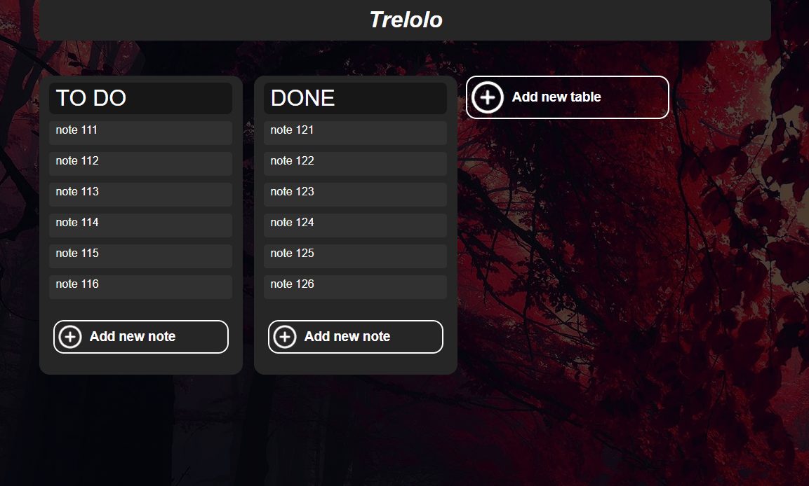

# Trelolo

This project was generated with [Angular CLI](https://github.com/angular/angular-cli) version 10.2.0.

Inspiration for the project was [Trello](https://trello.com/) website. The solution implements the same concepts of the user being able to create and modify different desks of tasks to accomplish different goals. Still in the development process.

## Planning to add

* Possibility to change background color
* Scroll on touch
* Responsive scrolling 
* Option to choose a color palette

## Development server

Run `ng serve` for a dev server. Navigate to `http://localhost:4200/`. The app will automatically reload if you change any of the source files.
